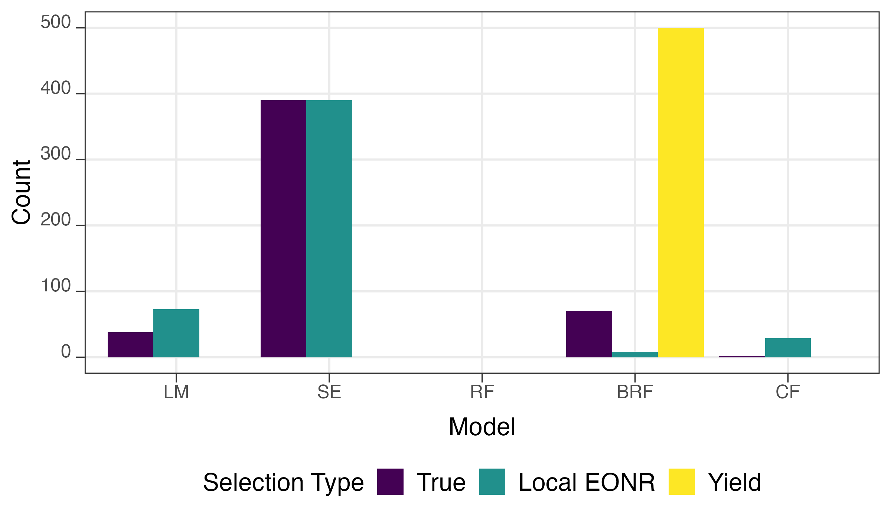

```{r echo = F, cache = F, include = F}
library(knitr)

opts_chunk$set(
  fig.align = "center",
  fig.retina = 6,
  warning = F,
  message = F,
  cache = FALSE,
  echo = F,
  error = T
)
```

```{r cache = F, include = F}
#--- packages ---#
library(tidyverse)
library(data.table)
library(officedown)
library(officer)
library(flextable)
library(stringr)
library(sf)
library(flextable)
```

```{r, eval = FALSE}
# create figures and tables by running 3_present_results.rmd

knitr::purl("../Codes/3_present_results.rmd")
source("../Codes/3_present_results.R")
```


# Introduction

In conventional agriculture, the natural spatial variations within a field are disregarded, and the entire area is managed uniformly. However, implementing uniformly spatial nitrogen management can result in economic and environmental inefficiencies [@fassa2022site]. One potential solution to address this issue involves implementing site-specific (variable rate) nitrogen application techniques that can recognize spatially heterogeneous crop nitrogen demand [@fassa2022site; @malzer1996corn]. Such  management practices can improve the profits of production while reducing its environmental impacts [@bullock1994quadratic; @puntel2016modeling; @wortmann2011nitrogen; @lobell2007cost; @malzer1996corn; @termin2023dynamic; @wen2022optimizing]. 

A variety of methods have been developed to provide site-specific nitrogen recommendations. These methods include yield goal-based N recommendations, the Maximum Return to N (MRTN) [@ransom2019statistical] and the use of remote sensing techniques [@reussi2015using; @oliveira2013calibrating]. Other approaches to estimate EONR are crop simulation models [@miao2006evaluating]. Adapt-N [@melkonian2008adapt] and Maize-N [@setiyono2011maize] use computer simulation models for nitrogen recommendations. soil testing and nutrient analysis [@bundy1995soil] are also among other N recommendation approaches.

One of the emerging and promising approaches for providing site-specific N management is through on-farm precision experiments (OFPE). OFPE employs technologies like GPS and variable rate input applicators to conduct experimental designs and nitrogen trials within the field [@paccioretti2021statistical]. Subsequent to data collection and collation, including variables like yield, as-applied nitrogen, soil characteristics, and weather conditions, statistical analysis is performed to estimate site-specific yield response function, which then can be used to identify site-specific EONR [@de2023predicting; @morales2022generation; @li2023economic]. 

Machine learning (ML) is a statistical tool for analyzing experimental data and providing site-specific EONR recommendations based on modeled yield responses to different inputs. When utilizing ML techniques to estimate site-specific EONRs from experimental data, it is important to recognize that the purpose of conducting experimental designs is to capture the variability of crop responses to input applications [@paccioretti2021statistical], forming the basis for EONR estimation. However, using ML to estimate EONRs requires caution. Several emerging studies [@barbosa2020risk; @barbosa2020modeling; @krause2020random; @gardner2021economic]  have employed ML techniques to predict site-specific EONRs using data from OFPE. However, they consistently select ML methods based on their ability to accurately predict yield. This raises a significant question, especially when the primary goal is to provide reliable site-specific EONR recommendations. A strong counterpoint to this practice is presented by @kakimoto2022causal. Through simulations, the study showed that achieving high accuracy in yield prediction does not necessarily imply accurate EONR prediction. This underscores the importance of understanding the causal relationship between treatment variables and crop yield. Empirical evidence further supports this idea, as studies have found that the correlation between EONR and the corresponding yield at EONR is weak [@morris2018strengths; @sawyer2006concepts; @vanotti1994alternative]. 

In this study, we use simulated data and apply ML techniques to propose a new approach for model selection to predict EONR. This approach is based on the spatial cross-validation and involves deriving yield responses to input variables in order to estimate local EONRs. Our inspiration for this method draws from the work of @de2023predicting. The approach uses spatial clustering to divide data into folds for training and testing. Within each fold, our candidate ML models estimate local EONR values. The performance of these estimates is evaluated by comparing them against a benchmark model using Root Mean Squared Error (RMSE). We further train the models on the complete dataset and rank them based on their RMSE in relation to the true EONR values. By comparing the rankings of locally estimated EONR values with the true values, we assess the performance of our local EONR model selection. Additionally, we evaluate the performance of a yield-based model selection approach. We found that the local EONR model selection approach consistently outperforms the yield-based model selection method when it comes to choosing a model for effectively predicting site-specific EONR.


# Materials and Method

## Data generation

### Field layout

### Experimental Design

### Yield data

## Models and estimation procedures

In our simulations, the model selection approaches under consideration are tasked with selecting the best-performing model (with their own criteria) from a pool of five candidate models: random forest, boosted regression forest, causal forest, linear model, and spatial error model. Each of these models is trained using an identical set of variables, namely $N$, $\alpha$, and $\beta$. Here, we detail how each model is trained on a given dataset and subsequently how the site-specific EONRs are estimated based on the trained model. 

+ Train dataset ($\Sigma$)
+ Target data ($\Phi$): 
  + N_{target}: the number of observations in the target dataset

### Random Forest and Boosted Regression Forest

For, random forest and boosted regression forest, yield response function are non-parametrically estimated.

$$
\hat{N}_i =  argmax_{N}\;\; P_c \hat{f}(N, X|\Sigma) - P_N N
$$

### Causal Forest (CF)

For the CF approach, four treatments are defined where the lowest rate (N_1) serves as the base line: N_2 vs N_1

Multiarm causal forest 

@kakimoto2022causal

### Linear (in parameter) and spatial error models

Unlike RF, BRF, and CF, yield response function is parametrically estimated for linear model and spatial error line model. Linear model estiamtes the following quadratic model:

$$
y_i = \alpha_i + \lambda_1 N_i + \lambda_2 \alpha_i \cdot N_i + \lambda_3 \beta_i \cdot N_i + \lambda_4 N^2_i + \lambda_5 \alpha_i \cdot N^2_i + \lambda_6 \beta_i \cdot N^2_i + v_i
$$

Spatial error model uses the same estimating equation, but recognizes the spatial correlation in the error term and statistically more efficient than the linear model.

Once the model is trained, site-specific EONR can be found by the following closed form equation:

\begin{equation}
\hat{N}^*_i = 
(\#eq:site-specific-eonr-formula)
\end{equation}


## True model performance in estimating Site-Specific EONR

### Site-specific EONR estimation

The main goal of the MC simulations is to assess and compare the ability of the two model selection procedures to select a model that estimates site-specific EONR well (not yield well). To achieve this simulation goal, it is necessary to identify the best performing model under the circumstance replicating the actual situation researchers faces: that is estimate models using the data from the whole field and estimate site-specific EONR for the very field on which data is obtained via an on-farm experiment. The performance of the candidate models obtained here serve as the reference point to be compared against the ranking of their models suggested by the two model selection procedures. For example, suppose our LE-selection method suggests RE and Y-selection method suggests BRT as the top-performing model based on their own criteria. Further suppose that the process described here suggests BRT as the best performing model, then that would mean that the LE-selection method worked better for that iteration.

Specifically, we take the following steps for each of the candidate models for a given field:

1. train the model using all the observations from the field
2. find EONR for all the observation points (site-specific EONR) of the field 
3. compare the estimated site-specific EONR with the true EONRs and calculate RMSE of EONR estimation

Once these steps are completed, then the candidate models are ranked based on their RMSE of EONR estimation. This process is repeated for all the fields. Note that step 3 of the above process compares the estimated EONR with the \textit{true} EONR and the obtained RMSEs represent the true performance of the models' ability to estimate site-specific EONR. This is possible only because we know the underlying site-specific yield response functions. 

### Model Performance

We use two criterion to evaluate the performance of the candidate models. First, we use RNSE of site-specific EONR prediction. Let $\widehat{N}^*_{m}(X_i)$ denote the estimated EONR for cell $i$ based on the trained model $m$. Hereafter, the collection of EONR for all the cells are called simply site-specific N prescription. 

Then, the RMSE for model $m$ is

\begin{equation}
RMSE_{f,m} = \sqrt{\frac{\sum_{i=1}^N(\widehat{N}^*_{m}(X_i) - N^*_i)^2}{N}}
(\#eq:rmse-eonr-true)
\end{equation}

Second, we use profit loss relative to the true site-specific EONR. The average per-acre profit from true site-specific EONR (denoted as $\pi_{true}$) is

\begin{equation}
\pi_{true}  = \frac{1}{N}\cdot \sum_{i=1}^{N} [P_c \cdot f(N^*_i, X_i) - P_N \cdot N^*_i]
(\#eq:label)
\end{equation}

This represents the maximum profit achievable average per-acre profit if you were to know the true site-specific EONR.

The average profit per acre associate with the site-specific N prescription by model $m$ (denoted as $\pi_m$), which is defined as

$$
\pi_m  = \frac{1}{N}\cdot \sum_{i=1}^{N} [P_c \cdot f(\widehat{N}^*_{m}(X_i), X_i) - P_N \cdot \widehat{N}^*_{m}(X_i)]
$$

Then the profit loss of model $m$ relative to the true maximum profit achievable (denoted as $\pi-loss_{m}$) is then defined as

$$
\Delta\pi_m  = \pi_{true} - \pi_m
$$

The lower the value of $\Delta\pi_m$, the better.

## Model Selection

We implement two model selection approaches: one based on yield prediction accuracy and the other based on local EONR prediction accuracy. For both approaches, spatial cross-validation is employed. The entire dataset is split into a train and test dataset in a spatially clustered manner, which is repeated to create multiple folds as depicted in Figure \ref{}. 

### Model selection based on yield 

For each of the fold, the following steps are implemented for each of the candidate models:

\begin{enumerate}
\item train the model using the train data
\item predict yield for each of the observations in the the test data based on the trained model ($\widehat{y^_{i, f,m}}$)
\item calculate RMSE of yield prediction as $RMSE-Yield_{f,m} = \sqrt{\sum_{i=1}^{N_t}(\hat{y_{i,f,m}} - y_{i,f,m})^2/N_t}$
\end{enumerate}

Once the above process is completed for all the folds, then average RMSE-Yield is calculated for each model and the model with the lowest average RMSE value is selected. 

### Model selection based on local EONR 

In validating models, it would be ideal if we could assess models based on their ability to estimate site-specific EONRs rather than yields because our ultimate interests lie in estimating EONRs, not yields. Of course, this is not possible because the true EONRs are never observable in the real world setting unlike yield. We propose to overcome this challenge by validating on "local uniform EONR" estimated by a statistical model. Specifically, we train a GAM model using the test data and predict the uniform EONR for the test data, which we call local EONR. We then treat the estimated local EONR as the proxy for the true local EONR and select models that are capable of predicting the estimated local EONRs the best. Clearly, for this approach to perform well, it is vital that the estimation of local EONR is accurate enough (Later we assess the accuracy).

For each of the fold, the following steps are implemented to estimate local EONR:

\begin{enumerate}
\item train the GAM model using the test data 
\item find uniform EONR for the test data ($\widehat{N^*_{f,gam}}$)
\end{enumerate}

For each of the fold, the following steps are implemented for each of the candidate models:

\begin{enumerate}
\item train the model using the train data 
\item find uniform EONR for the test data based on the trained model ($\widehat{N^*_{f,m}}$)
\end{enumerate}

Once the above processes are completed for all the folds, then the RMSE of estimating local EONR is calculated for each model as follows:

\begin{align}
RMSE-LE_{m} = \sqrt{\sum_{f=1}^F (\widehat{N^*_{f,m}} - \widehat{N^*_{f,gam}})^2 / F}
\end{align}

Then, the model with the lowest RMSE would be chosen as the selected model from this model selection method.

## Evaluation of model selection performance

Model selection performance is evaluated based on the performance of the model selected by the model selection approach.

Two criterion to evaluate model selection performance are used. First, they are evaluated based on the percentage of the times the selection approach picked the true best model in estimating EONR. The second and more practically informative criteria is based on profit deficit when the selected model was used instead of the true best model. 

For example, let $m^*_f$ denote the true best model for a given field $f$, then the highest profit that could be achieved would be $\pi_{m^*_f}$ (defined in equation ..).
Not knowing what the true best model, one needs to rely on a model selection procedure to pick a model. Suppose the procedure suggested model $m$, then the profit loss relative to $\pi_{m^*_f}$ is $\pi_{m^*_f} - \pi_{m}$. If the produce is able to suggest the true best model, then the profit loss will be zero. The lower the value of profit loss, the better a selection approach is. 

# Results and Discussions

## Performance of the model selection approaches

Figure \@ref(fig:selection-performance) presents the number of times models are selected by the two model selection approaches and also selected as the actual best perfoming model in terms of site-specific EONR prediction using RMSE. Hereafter, we mean performing the best in predicting site-specific EONR by "performs the best" unless otherwise noted for the sake of consiseness. Yield-based model selection approach selected BRF for all the 500 simulation rounds. However, BRF was actually the best in only about 70 rounds. Among the candidate models, the linear spatial error model was the best most often at about 380 rounds. Our model selection approach, on the other hand, selects SE as often as it is selected as the actual best. Our model selection approach tends to select BRF much less than it is chosen as the actual best. 

```{r fig.id = "selection-performance", fig.cap = "Frequency of models selected by the two selection approaches and selected as the actual best (lowest RMSE of site-specific EONR prediction)", fig.height = 3.5, fig.width = 6, dpi = 600, cache = FALSE}
# g_ranking

```

```{r}
accuracy_table <- readRDS(here::here("Writing/FiguresTables/selection_accuracy_table.rds"))

main_table <- accuracy_table[num_repeats == 10 & num_folds == 10, ]

num_se_by_leonr <- main_table[method == "S-learner (SE)", num_selected_leonr]

num_se_by_leonr_correct <- main_table[method == "S-learner (SE)", num_selected_leonr_correct]

num_se_true <- main_table[method == "S-learner (SE)", num_selected_true]

num_all_by_lenor_correct <- main_table[, sum(num_selected_leonr_correct)]

num_lm_by_lenor <- main_table[method == "S-learner (Linear)", num_selected_leonr]

num_lm_by_lenor_correct <- main_table[method == "S-learner (Linear)", num_selected_leonr_correct]

num_brf_by_yield_correct <- main_table[method == "S-learner (BRF)", num_selected_yield_correct]
```

Figure \@ref(fig:leonr-comp)

```{r, fig.id = "leonr-comp", fig.cap = "Comparison of average model-estimated LEONR and GAM-estimated LEONR", fig.height = 4, fig.width = 6, dpi = 600, cache = FALSE}
readRDS(here::here("Writing/FiguresTables/g_leonr_comp.rds"))
```

Table \@ref(tab:accuracy-table) provides a deeper insights into the performance of the model selection approaches. Numbers in parenthesis indicate the number of times the model is selected. For example, the LEONR-based approach selected the SE model `r num_se_by_leonr` times. Numbers to the left of parenthesis indicates the number of times the model is correctly selected, meaning that a selection approacha selected the model that indeed performed the best. For example, among the `r num_se_true` times the SE model performed the best, the LEONR-based approach selected the SE model correclty `r num_se_by_leonr_correct` times. The LEONR-based approach selected the liner model `r num_lm_by_lenor` times, but its choice was correct only `r num_lm_by_lenor_correct` times. In total, the LEONR-based approach correctly selected the best model `r num_all_by_lenor_correct` times. The yield-based approach selected the BRF model for all the simulation rounds, while its choice is correct only `r num_brf_by_yield_correct` times. Overall, the LEONR-based approach performs far better than the yield-based approach.

```{r tab.id = "accuracy-table", tab.cap = "table-name"}
readRDS("FiguresTables/main_selection_accuracy_table.rds")
```

Even when a selection approach selects a model that is not the best in predicting site-specific EONR, the selection approach is considered performing well as long as its site-specific EONR is similar to that of the true model because the selected model would achieve a similar level of profit as that from the best model in such a circumstance. Figure \@ref(fig:profit-loss) presents the distribution of the loss in profit relative to the actual best model. For example, if a selection approach correctly selects the best model, then the profit loss for that round would be zero. However, if a selection approach selects a sub-optimal model and its site-specific EONR recommendation make $10/acre less than the profit generated by the recommendation from the best model, then the profit loss for that round is 10. Since agricultural producers' ultimate interest lies in the profitability, this measure is more relevant than the frequency of correctly secting the best model. As can be seen in the figure, the LEONR-based selection would result in a much smaller profit loss (much higher profit) compared to the yield-based selection.

```{r, fig.id = "profit-loss", fig.cap = "Distribution of profit loss relative to the actual best model", fig.height = 4, fig.width = 6, dpi = 600, cache = FALSE}
readRDS(here::here("Writing/FiguresTables/g_pi_loss.rds"))
```

## Local EONR estimation

Our selection approach replaces true local EONRs with local EONRs estimated by GAM. Therefore, it goes without saying that the accuracy of local EONR estimation by GAM is critical for our selection approach. Figure \@ref(fig:leonr-estimation-accuracy) presents the scatter plots of true LEONR (y-axis) and estimated LEONR (x-axis). Even though the GAM approach has a slight tendency to over-estimate LEONR (about $10$ lb/acre), it produces estimates that are highly correlated with true EONR, which is crucial for our approach to work. Our selection approach used GAM because it is capable of capturing the functional form of yield response to nitrogen without any functional form assumptions unlike quadratic or quadratic-plateaur functional forms typically used in empirical studies. However, our model selection approach is of course not just limited to GAM, and it may be worthwhile to explore other statistical approaches as a way to estimate LEONR in future studies.

```{r, fig.id = "gam-leonr", fig.cap = "Accuracy of estimating LEONR by GAM", fig.height = 4, fig.width = 6, dpi = 600, cache = FALSE}
readRDS(here::here("Writing/FiguresTables/g_gam_leonr.rds"))
```

## The role of the number of repeats and folds


# Conclusion

# References

::: {#refs}
:::


# Appendix

## The impact of different fold repeat combination on local EONR selection and yield selection method

```{r fig.id = "fig-7", fig.cap = "The impact of different fold repeat combinations\non local EONR and yield selection method", fig.width = 4, fig.width = 6, dpi = 400, cache=FALSE}
```

Figure \@ref(fig:fig-7) presents a comparison of two model selection criteria: local EONR and yield-based, across various combinations of folds and repeats. The x-axis represents the ranking of the ML models in estimating true site-specific EONRs, with rank 1 indicating the best-performing model in estimating site-specific EONRs compared to the true EONRs.

In the context of local EONR model selection, the y-axis depicts the frequency of selecting the right model. The local EONR criterion consistently demonstrated an increasing trend in accuracy as the number of folds and repeats increased. For example, with 5 folds and 1 repeat, the correct model was selected in approximately 57.2 percent of simulations. This success rate improved to 58.4 percent with 5 repeats, and further to 62.4 percent with 7 folds and 5 repeats. Notably, increasing the number of folds to 10 while maintaining 5 repeats resulted in a substantial improvement, achieving a success rate of 65.8 percent. The pattern continued across different combinations, such as 5 folds and 10 repeats (59.4 percent success) and 10 folds and 10 repeats (65.2 percent success). This consistent improvement in accuracy underscores the positive impact of increasing the number of folds and repeats on the local EONR model selection.

In contrast, the yield-based model selection exhibited a lower success rate in identifying the best-performing model for EONR estimation. Across all combinations of folds and repeats, the yield-based method consistently achieved a success rate of approximately 14.2-14.4 percent. This low success rate remained largely unaffected by variations in the number of folds and repeats. Consequently, it can be inferred that altering the fold and repeat parameters did not significantly influence the performance of the yield-based model selection in accurately identifying the optimal model for EONR estimation.

The findings from these two model selection criteria highlight a clear distinction in their responses to different combinations of folds and repeats. While the local EONR criterion exhibited a notable increase in accuracy as folds and repeats were increased, the yield-based model selection method consistently demonstrated limited effectiveness across all scenarios. 

## Correlation Between GAM-Estimated EONR and True EONR

```{r fig.id = "fig-cor-gam-leonr", fig.cap = "GAM vs True EONR", fig.width = 4, fig.width = 6, dpi = 400, cache=FALSE}
```

Figure \@ref(fig:fig-cor-gam-leonr) depicts the correlation between the true EONRs and the gam estimated local EONRs. The analysis considers multiple combinations of folds and repeats. Notably, a robust and consistent association is observed between the GAM-estimated local EONRs and the true EONRs, regardless of the specific number of folds and repeats utilized. This finding suggests that the estimated local EONRs derived from the GAM serve as a reliable proxy for the true EONRs. 
GAMs often employ advanced smoothing techniques, such as spline functions, to estimate non-linear relationships. These smoothing techniques are adept at reducing noise within the data and revealing underlying patterns, ultimately leading to enhanced predictive accuracy. Another factor that strengthens GAM's role as a viable stand-in for true EONRs is our thorough model tuning and validation process, which reinforces the model's reliability and performance.


