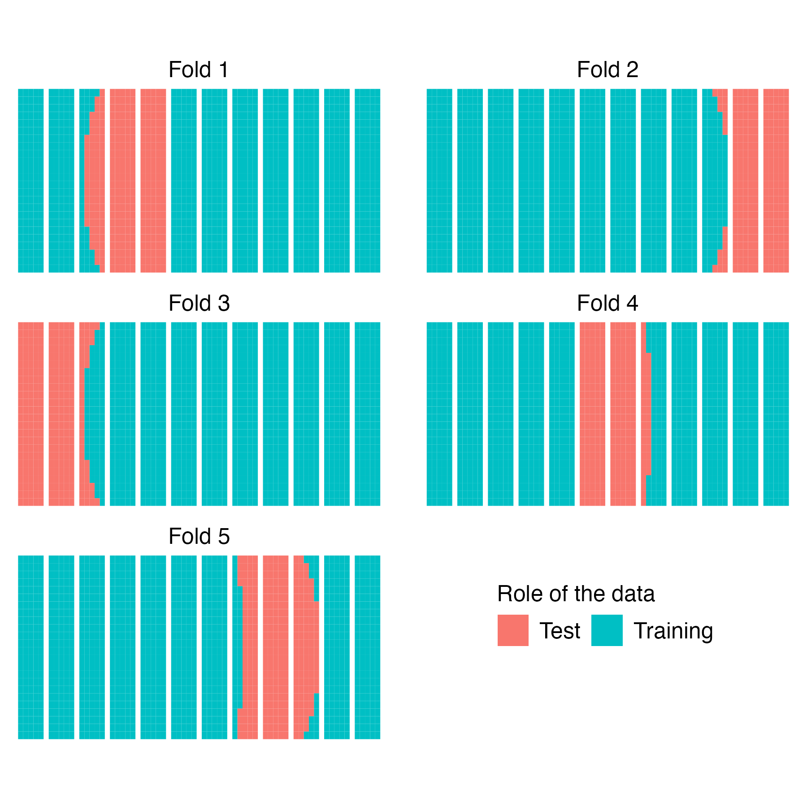
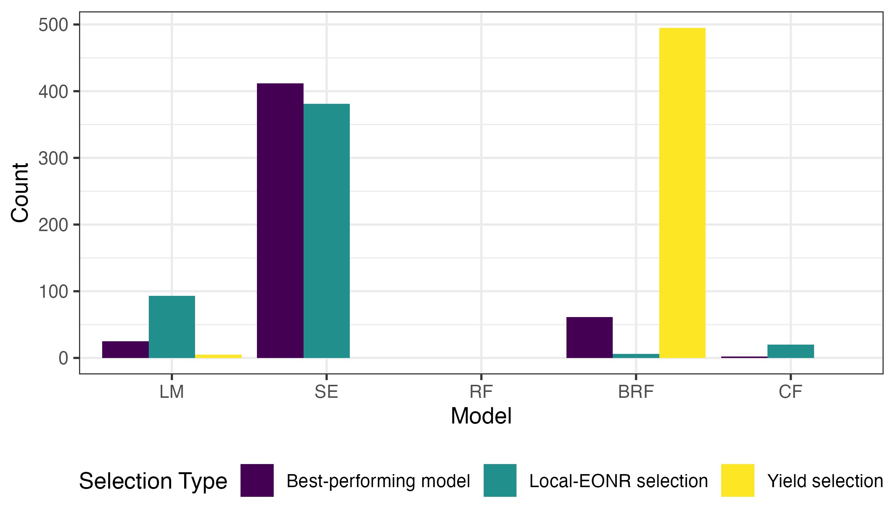
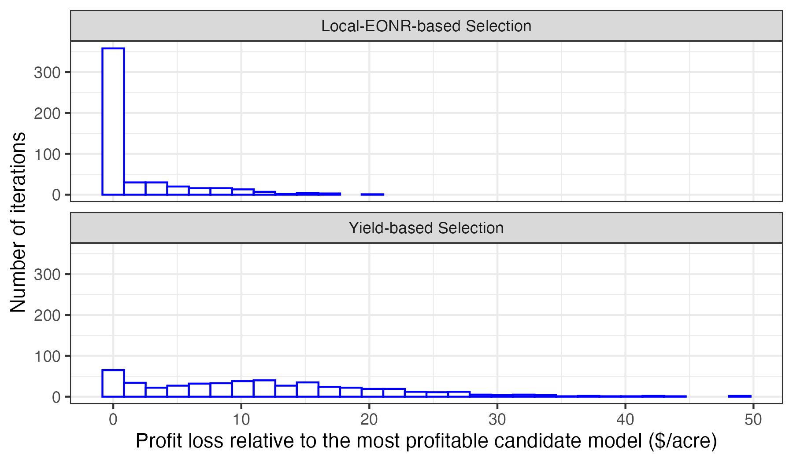
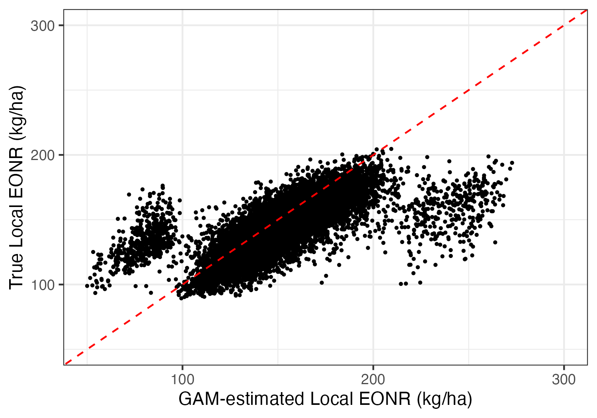
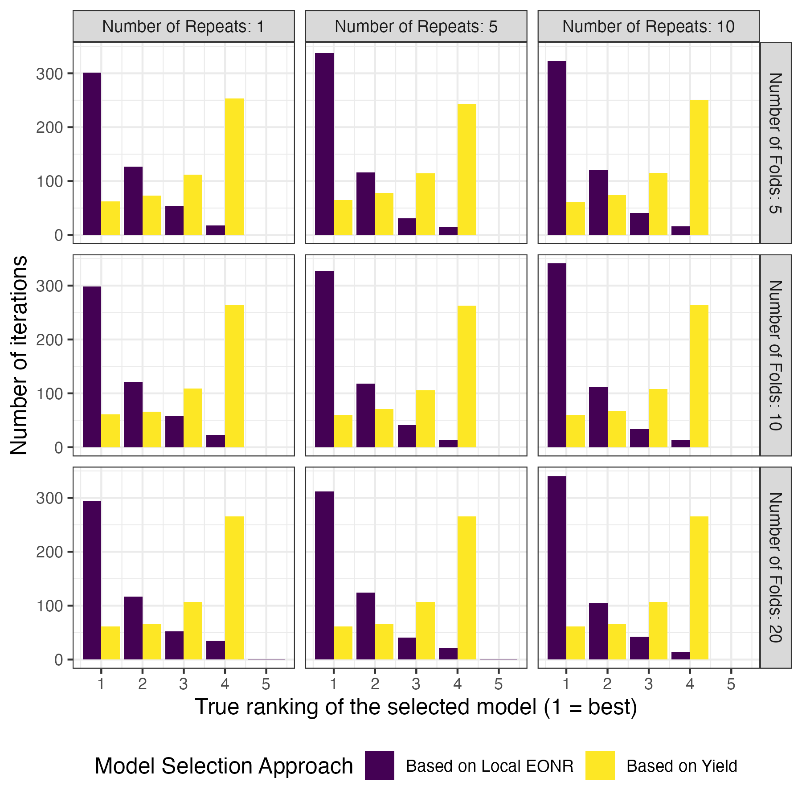
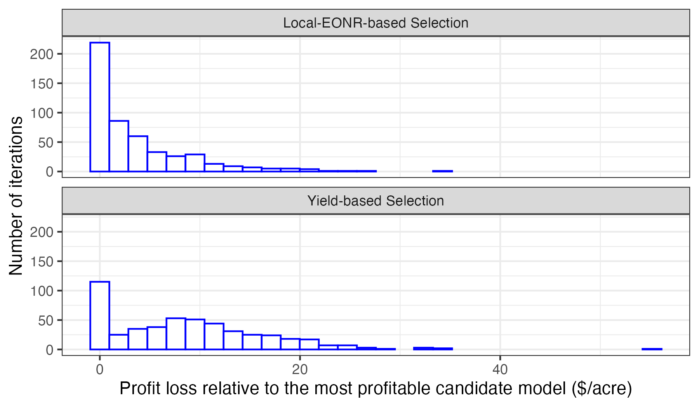

```{r echo = F, cache = F, include = F}
library(knitr)

opts_chunk$set(
  fig.align = "center",
  fig.retina = 6,
  warning = F,
  message = F,
  cache = FALSE,
  echo = F,
  error = T
)
```

```{r cache = F, include = F}
#--- packages ---#
library(tidyverse)
library(data.table)
library(officedown)
library(officer)
library(flextable)
library(stringr)
library(sf)
library(flextable)
```

```{r}
#| label: setup-calibration
#| include: false

#--- calibration summary for Section 2.1 (produced by code/2-3-calibration-summary.R) ---#
calib <- readRDS("figures-tables/calibration_summary.rds")

#--- review-round analyses: inference + uniform-vs-VR baseline (code/2-4-review-analyses.R) ---#
rstat <- readRDS("figures-tables/review_stats.rds")

#--- prices (identical to code/2-1-summarize-results-main.qmd) ---#
pCorn_bu <- 6.25             # corn price, $/bushel
pN_lb    <- 1.00             # nitrogen price, $/lb
pCorn    <- pCorn_bu / 25.4  # $/kg
pN       <- pN_lb / 0.453592 # $/kg
```

### Keypoints / Highlights

- This study introduces a new model-selection approach for site-specific nitrogen management using independently estimated local economically optimal nitrogen rates (EONRs) as validation targets when true site-specific EONRs are not directly available ex ante. The proposed method aligns model selection with the economic objective of profitable site-specific nitrogen recommendations.

- The proposed approach identified the best-performing model for EONR estimation in 65.4% of simulations, compared with 12% for conventional yield-based selection, and reduced mean profit loss from \$11.97/acre to \$1.76/acre.

- The new model-selection method remained more effective than conventional yield-based selection across cross-validation designs and under weaker spatial correlation.

### Impact

This study advances precision nitrogen management by providing a practical model-selection framework that evaluates competing models using a locally derived economic validation target rather than yield-prediction accuracy alone, addressing the challenge that true site-specific EONRs are not directly available ex ante from conventional OFPE data. By aligning model selection with the economic decision the models are intended to support, the framework strengthens the use of OFPE data for developing more reliable and profitable variable-rate nitrogen recommendations.

### Keywords

Site-specific nitrogen management; Economically optimal nitrogen rate; Model selection; Spatial cross-validation; On-farm precision experimentation

# Abstract

**Purpose:** In modern site-specific nitrogen management, model selection is often based on yield-prediction accuracy, even though the ultimate goal is to estimate economically optimal nitrogen rates (EONRs) and improve profitability. This study introduces a model-selection approach based on local EONR rather than yield-level prediction.

 **Methods:** Using 500 Monte Carlo simulations of on-farm precision experimentation (OFPE) data, the proposed local-EONR-based approach was compared with yield-based selection across five candidate models: linear, spatial error, random forest, boosted regression forest, and causal forest. Because true site-specific EONRs are not directly available ex ante as validation targets when models are selected from conventional OFPE data, spatial cross-validation and generalized additive models were used to obtain independently estimated local EONRs as validation targets.

**Results:** The local-EONR-based approach identified the best-performing model for EONR estimation in 65.4% of simulations, compared with 12.0% for yield-based selection. Mean profit loss relative to the most profitable candidate model was \$1.76/acre under local-EONR-based selection and \$11.97/acre under yield-based selection. The advantage of the local-EONR-based approach was generally maintained across alternative cross-validation designs and under weaker spatial correlation.
  
**Conclusion:** These results show that yield-prediction accuracy alone may provide limited guidance for selecting models intended to generate economically optimal site-specific N recommendations. Incorporating local economic information into model selection provides a practical way to better align model evaluation with the management decision and improve the economic performance of variable-rate N recommendations.

### Statements and Declarations

**Funding:** This research was funded in part by the U.S. Department of Agriculture Natural Resources Conservation Service (USDA-NRCS) On-Farm Trials Conservation Innovation Grant, “Improving the Economic and Ecological Sustainability of US Crop Production through On-Farm Precision Experimentation,” award number NR213A7500013G021, and by the U.S. Department of Agriculture National Institute of Food and Agriculture (USDA-NIFA) Hatch Project 470-362.

**Competing Interests:** the authors declare no competing interests.

**Data Availability:** the data generated and analyzed during the current study are available from the corresponding author upon reasonable request.

\newpage

# Introduction

Uniform input management strategies, such as applying the same nitrogen rate across an entire field, can lead to both economic losses and environmental inefficiencies when crop response varies spatially [@fassa2022site]. A widely recognized solution is site-specific, or variable-rate, input management, which accounts for spatial heterogeneity in crop yield response to input application rates [@fassa2022site; @malzer1996corn; @bullock1994quadratic; @puntel2016modeling; @wortmann2011nitrogen; @lobell2007cost; @termin2023dynamic; @wen2022optimizing]. To support site-specific management decisions, several experimentation approaches have been developed to collect spatially dense response data under commercial farming conditions. Among emerging approaches, on-farm precision experimentation (OFPE) is considered promising. OFPE leverages GPS technologies and variable-rate applicators to implement input experiments where input rates are varied within the field [@paccioretti2021statistical]. Data collected—including yield, applied nitrogen, soil characteristics, and weather—are subsequently analyzed to estimate site-specific yield response functions, which serve as the basis for determining economically optimal nitrogen rates (EONR) at fine spatial scales [@de2023predicting; @morales2022generation; @li2023economic]. 

In recent years, machine learning (ML) approaches have increasingly been used for estimating site-specific yield response functions [@barbosa2020risk; @barbosa2020modeling; @krause2020random; @gardner2021economic]. Because multiple candidate models and hyperparameter specifications may be available, model selection is an important part of this process. In modern site-specific crop management applications, the best model is commonly selected based on predictive performance for observed yield [@tanaka2024can] (referred to here as yield-based model selection). However, the ultimate goal is not to predict yield levels, but to estimate yield response to nitrogen, which is the quantity needed to determine economically optimal application rates. Indeed, @kakimoto2022causal show that achieving high accuracy in yield prediction does not necessarily imply accurate yield response or EONR. Empirical studies have likewise reported a weak relationship between EONR and the yield attained at EONR [@morris2018strengths; @sawyer2006concepts; @vanotti1994alternative]. Therefore, it seems questionable to select the best model based on its ability to predict yield level instead of yield response when the ultimate goal is to provide  profitable variable-rate input recommendations.

The use of economic criteria to evaluate agricultural production functions is not new. Agricultural economists have long recognized that the choice of a production-function specification affects the economically optimal quantities of inputs implied by that function [@heady1961agricultural]. More generally, when model outputs are used to make decisions, model evaluation should account for the decision-relevant objective rather than predictive fit alone. This principle also appears in more recent work on prediction policy problems [@kleinberg2015prediction] and decision-focused and "predict-then-optimize" learning [@elmachtoub2022smart; @bertsimas2020predictive]. The contribution of the present study is therefore not the general idea that economic consequences should matter in model evaluation. Rather, it addresses a specific challenge in site-specific nitrogen management: how to implement economically relevant model selection when the local decision target required for validation is not directly available from the data used to fit and evaluate the models.

Ideally, candidate models could be evaluated according to their accuracy in predicting the local EONR. However, site-specific EONRs are not known ex ante, when nitrogen-management decisions must be made. They may be estimated ex post when sufficiently dense and precise experimental measurements are available, but the conventional combine yield-monitor data used in OFPE impose important limits on the precision of very local estimates. Yield-monitor measurements depend on the actual cutting width and can also be affected by grain-transport dynamics and other measurement processes [@reitz1996investigations]. In contrast, spatially dense experimental measurements using more direct harvest methods, such as hand harvest or plant-level robotic harvest, could potentially support more precise ex post estimation of local yield response and EONR. Even a highly accurate ex post EONR, however, remains only an approximate guide for future nitrogen decisions because spatial yield-response patterns can change between seasons with rainfall distribution, pest pressure, microclimate, and other growing conditions [@machado2002spatial; @alesso2024spatial; @weselek2021agrivoltaic]. The practical model-selection problem is therefore to identify models that provide economically useful nitrogen recommendations when the relevant local EONR is unavailable as a direct validation target given the available data and experimental design.

This study developed an alternative to conventional yield-based model selection for this setting. An independently estimated local EONR was constructed within a spatial cross-validation framework and used to evaluate candidate models according to their ability to recover economically relevant local nitrogen rates rather than observed yield levels. The proposed local-EONR-based selection approach was evaluated using Monte Carlo simulations of site-specific nitrogen response and compared with conventional yield-based selection across multiple candidate modeling approaches. Its performance was assessed by both the frequency with which it identifies the best-performing EONR model and the economic consequences of the resulting variable-rate nitrogen recommendations. The results showed that local-EONR-based selection more often identified the best-performing candidate for EONR estimation and resulted in lower profit losses than yield-based selection, thereby better aligning model selection with the management objective.

# Method

A Monte Carlo simulation framework with 500 iterations was used to compare the local-EONR-based and yield-based model-selection approaches. Simulation was necessary because the true site-specific yield responses and EONRs were known for each simulated field. This information provided a benchmark for determining how well each candidate model actually performed and, subsequently, whether a model-selection approach was able to identify a good candidate using only the information that would be available from an OFPE.

Each simulation iteration followed four steps:

*Step 1: Generate OFPE data.* A spatially heterogeneous corn field was generated with known site-specific yield-response functions and EONRs. An on-farm N experiment was then simulated to produce the yield, N-rate, and field-characteristic data used in the subsequent analysis.

*Step 2-1: Identify the best-performing candidate model.* The five candidate models were fitted to the complete simulated OFPE dataset and used to generate site-specific EONR recommendations. Because the true EONRs and yield-response functions were known in the simulation, the actual performance of each candidate could be evaluated. The candidate with the lowest error in estimating the true site-specific EONRs served as the benchmark for evaluating model-selection accuracy.

*Step 2-2: Select a model using the two model-selection approaches.* The same candidate models were then evaluated using spatial cross-validation. One approach selected the model with the best yield-prediction accuracy, whereas the proposed approach selected the model that best matched independently estimated local EONRs. Importantly, neither selection approach used the true site-specific EONRs or the known yield-response functions from the simulation. 
 
*Step 3: Evaluate model-selection performance.* The models selected in Step 2-2 were first compared with the best-performing model identified in Step 2-1 to assess selection accuracy. The economic consequences of model selection were then evaluated by comparing the profit generated by each selected model with the profit generated by the most profitable candidate model.


The five candidate modeling approaches were a linear model (LM), spatial error model (SE), random forest (RF), boosted regression forest (BRF), and causal forest (CF). The distinction between Steps 2-1 and 2-2 is central to the evaluation: Step 2-1 used the known simulation truth only to establish how the candidate models actually performed, whereas Step 2-2 reproduced the model-selection problem encountered with OFPE data, where that information is not available.


## Data generation (Step 1)

### Simulated experimental field

The data for this study were generated from a simulated corn production field with spatially varying field characteristics. The field was 432m wide and 864m long, covering approximately 37.3 hectares. @fig-field-map illustrates one possible scenario of the spatial variability in the field characteristics, where the spatial resolution of the variability is the basic unit of the 6m × 6m "cell". 

```{r}
#| label: fig-field-map
#| fig-cap: "Illustration of the simulated on-farm precision experiment (OFPE) field."

knitr::include_graphics(here::here("writing/figures-tables/g_field_map.png"))
```

An on-farm precision experiment (OFPE) of corn yield response to N rates was conducted in this simulated field. The spatial unit at which experimental N rates were applied was larger than the basic cell unit. It was assumed to be 18m wide and 72m long (or 3 cells × 12 cells), referred to as a “plot.” The choice of this plot dimension was to accommodate the width and application accuracy of the commercial variable-rate applicators currently used on the market. The true yield data varied at the basic cell resolution, but in practice the commercial yield monitoring system could not reliably achieve such a fine spatial resolution. Yield data were therefore assumed to be collected at an 18 m × 12 m (3 cells × 2 cells) resolution, referred to as a “subplot.” Thus, cells represented the underlying fine-scale yield-response variability, plots represented the spatial scale of N treatment application, and subplots represented the spatial scale at which yield was observed for model estimation. The 18 m subplot width was set equal to the width of the N-treatment plot so that each yield subplot corresponded to a single N treatment. The 12 m length of the yield-data unit was chosen based on the distance required for the yield-monitoring system to provide accurate yield measurements. In addition, a 12m “transition zone” was put between two adjacent N plots, allowing the yield-monitoring system to stabilize as the harvester crossed between adjacent N-treatment plots. After excluding the transition zones, each N plot contained five effective yield subplots for data analysis. A detailed layout map of the field that illustrated the spatial units of “cell”, “subplot”, and “plot” was displayed in @fig-field-map. In total, the simulated OFPE dataset included 288 N plots, 1440 yield subplots, and 8640 cells. This design therefore distinguished the underlying cell-level response used as the simulation truth from the coarser yield information available to the model-selection procedures.

### True yield responses

Because evaluation of the model-selection approaches required knowledge of the true yield response and economically optimal nitrogen rates, both were specified for every cell in the simulated field. The true yield at each cell was assumed to follow a quadratic-plateau functional form:

$$
y_{j, i}=f_{j, i}(N)= \begin{cases}\alpha_{j, i}+\beta_{j, i} N+\gamma_{j, i} N^2+\varepsilon_{j, i}, & N<\tau_{j, i} \\ \eta_{j,i}+\varepsilon_{j, i}, & N \geq \tau_{j, i}\end{cases},
$$ {#eq-yield-response}

with $j \in{1,\ 2,\ 3,...,1440}$ being the subplot index and, $i \in{1,\ ...,6}$ being the index of cells within a subplot. The index pair $(j, i)$ identified each of the field’s cells. The response parameters $\alpha_{j, i}$, $\beta_{j, i}$ and $\gamma_{j, i}$ represented zero-N yield and the linear and quadratic effects of N. The parameter $\tau_{j, i}$ represented the N rate at which the yield reached its plateau. Parameter $\eta_{j,i}$ denoted the plateau yield. The stochastic error term $\varepsilon_{j, i}$ followed a normal distribution and exhibited spatial autocorrelation. The quadratic-plateau specification represented diminishing yield gains from additional N until a yield plateau was reached, a common pattern of corn yield response to N [@frank1990]. The response parameters varied across cells so that different locations within the field had different yield levels and responses to N. These spatially varying parameters represented differences in soil, water availability, and other field characteristics that influenced crop response to N.

Because the complete yield-response function was known in the simulation, the true economically optimal N rate for each cell $N_{j, i}$ could be calculated directly by maximizing the value of crop production net of N cost:


$$
N_{j, i}^* \equiv \operatorname{argmax}_N\left[p \cdot f_{j, i}(N)-w \cdot N\right],
$$ {#eq-true-eonr}

where $p$ denoted the crop price, set to \$`r pCorn_bu`/bushel (\$`r round(pCorn, 3)`/kg), $w$ denoted the nitrogen fertilizer price, set to \$`r format(pN_lb, nsmall = 2)`/lb (\$`r round(pN, 3)`/kg), and $f_{j, i}(N)$ was the previously defined true yield response function for the specific cell. The resulting cell-level EONRs characterized the underlying fine-scale economic optimum in the simulated field. Because observed yield and candidate-model predictions were analyzed at the subplot level, model performance was evaluated using the corresponding true EONR for each subplot. For subplot $j$, this true EONR is denoted by $N_{j}^*$ and was calculated from the known true yield-response parameters at the subplot level using the same profit-maximization criterion in @eq-true-eonr.

Within-field spatial variation in the yield-response parameters, as illustrated by @fig-field-map, was generated using spatially correlated Gaussian random fields. A total of 500 simulated fields were generated using the R package gstat [@pebesma2016]. The simulation parameters were calibrated so that, across the 500 fields, true cell-level EONRs ranged from `r calib$eonr_cell_min` kg/ha to `r calib$eonr_cell_max` kg/ha and average simulated yield was `r format(calib$mean_yield, big.mark = ",")` kg/ha. These values were comparable to empirical data from OFPEs conducted on eight corn production fields by the Data-Intensive Farm Management (DIFM) project in 2018 [@bullock2019], indicating that the simulated fields represented plausible corn production conditions. Additional details of the spatial simulation and variogram specification are provided in Online Resource 1, Section S1.1.


### Experimental design

Five experimental N rates were used in each simulated OFPE to span the range of yield responses needed to estimate the N-response relationship across the field. In each iteration, the lowest rate was set 40 kg/ha below the minimum and the highest rate 20 kg/ha above the maximum of the true cell-specific plateau N rates ($\tau_{j, i}$). Three intermediate rates were spaced between these values so that the experimental rates bracketed the true plateau points across all cells. Because a different field was generated in each simulation, the resulting N rates varied slightly across simulations. The average experimental N rates across the `r calib$n_sims` simulations were approximately $\{`r paste(calib$avg_trial_rates, collapse = ",\\ ")`\}$ kg/ha.

The five N rates were spatially allocated using the Latin-square-based design described by @li2023economic. Each rate appeared once within every row and column of the Latin square, and the pattern was repeated across the simulated field, which contained 288 N-treatment plots arranged as 12 plots along the field length and 24 plots across the width. The allocation was designed to avoid large, abrupt changes in N rate between adjacent plots along the direction of fertilizer application. This design reflected practical limitations in the accuracy of commercial variable-rate N application equipment and has been shown to provide superior economic performance relative to alternative trial designs [@li2023economic]. An example of the experimental N-rate allocation is shown in the top panel of @fig-Nrate-yield. 


```{r}
#| label: fig-Nrate-yield
#| fig-cap: "Experimental design of five nitrogen rates (top) and observed yield data (bottom)."

knitr::include_graphics(here::here("writing/figures-tables/g_Nrate_yield.png"))
```

### Yield and N-rate data

Based on the experimental design, cell-specific response parameters, and stochastic error term $\varepsilon_{j,i}$, yield $y_{j, i}$ was generated for each cell using the true response function in @eq-yield-response. These cell-level yields were not assumed to be directly observed. Instead, yield was observed only at the 18 $\times$ 12 m subplot resolution described above. Therefore, the yields of the six cells within each subplot were averaged to obtain the observed subplot-level yield. The bottom panel of @fig-Nrate-yield illustrates the resulting yield observations across the 1440 subplots.

Experimental N rates were applied at the plot level, so all subplots within a given N-treatment plot received the same N rate. In each simulation, the resulting 1440 subplot-level observations of yield and applied N rate were used for model estimation.


### Observed field characteristics (independent variables) 

The true yield-response parameters and cell-specific EONRs represented the underlying simulation truth and were not provided to the candidate models. Instead, 12 spatially varying covariates were generated to represent observable field characteristics related to the underlying yield response. For subplot $j$, these covariates are denoted collectively by $X_j$. These covariates can be interpreted as proxies for field characteristics, such as soil and water-related conditions, that may help explain spatial differences in crop response to N.


The covariates were constructed from spatially correlated components of the true yield-response parameters. Their relationships with the underlying response parameters included both relatively simple additive patterns and more complex nonlinear patterns, providing variation in the types of relationships that the candidate models needed to recover. The candidate models were not given the mathematical relationships used to generate the covariates and therefore had to learn the association between the observed field characteristics, N rate, and yield from the experimental data.

The covariates were initially generated at the 6 m $\times$ 6 m cell resolution and then aggregated to the 18 m $\times$ 12 m subplot resolution to match the spatial scale of the observed yield data. The resulting subplot-level covariates were used, together with the experimental N rate, as predictors in the candidate yield-response models. Detailed equations describing the construction of the simulated covariates are provided in Online Resource 1, Section S1.2.


## Identifying the best-performing candidate model (Step 2-1)

Because the true subplot-specific EONRs were known in the simulations, the actual performance of each candidate model could be evaluated directly. For each simulated field, all five candidate models were trained using the full observed OFPE dataset and then used to estimate site-specific EONRs across the field. The estimated EONRs were compared with the corresponding true subplot-specific EONRs to evaluate the performance of each candidate model.

The procedures used to train the candidate models and estimate their site-specific EONRs are described below, followed by the measures used to evaluate their performance.

<!-- Both steps 2-1 and 2-2 involves yield response and variable rate EONR estimation for each of the candidate models even though they differ in training data and the target dataset for which site-specific EONR are estimted (hereafter target data).  -->


### Model training

All five candidate models used the same observed information: corn yield as the outcome variable and experimental N rate together with the observed field-characteristic covariates as predictors. The models differed in how they represented the relationship between these variables and, consequently, how they estimated spatial variation in yield response to N. The five candidate approaches were grouped into three types: linear and spatial error models, random forest and boosted regression forest, and causal forest. After each candidate model was estimated, site-specific EONRs were obtained by applying the same economic optimization principle as in @eq-true-eonr to the response to N estimated by that model. For candidate model $m$ and subplot $j$, the resulting EONR estimate is denoted by $\hat{N}^*_{m,j}$.

*Linear and spatial error models*

The linear model and spatial error model estimated yield response parametrically using a quadratic function of N. Interactions between N and the observed field characteristics allowed the estimated response to N to vary across locations within the field. The SE model used the same yield-response specification as the LM but additionally accounted for spatial correlation in the error term.

The quadratic specification was intentionally simpler than the quadratic-plateau function used to generate the true yield responses. This provided a realistic setting in which a candidate model could approximate the underlying response without being given its true functional form. Detailed specifications of the linear and spatial error models are provided in Online Resource 1, Section S2.1.

*Random Forest (RF) and Boosted Regression Forest (BRF)*

Random forest [@breiman2001random] and boosted regression forest [@friedman2001greedy] provided flexible, nonparametric alternatives to the linear models and did not impose a predetermined functional form on the relationship between yield, N rate, and observed field characteristics. Both models were estimated with the `grf` package [@tibshirani2018package] using 1,000 trees, with tuning parameters selected using the package's internal cross-validation procedure. This internal tuning criterion was independent of the yield- and EONR-based model-selection criteria evaluated in this study and therefore did not favor either approach.

For each location, the fitted RF and BRF models were used to predict yield over a range of possible N rates while holding the observed field characteristics fixed. These predictions provided the site-specific yield-response relationships used to determine EONRs. The mathematical formulation used to obtain site-specific EONRs from the RF and BRF predictions is provided in Online Resource 1, Section S2.2.

*Causal Forest (CF)*

Causal forest differed from the other candidate models because it was designed to estimate heterogeneous effects of changes in N rate rather than yield levels directly. This distinction made CF particularly relevant to the objective of estimating spatially varying yield responses to N [@kakimoto2022causal].

The five experimental N rates were treated as multiple N treatments, and CF estimated how the effect of increasing N from the lowest experimental rate varied with the observed field characteristics. These estimated treatment effects were then used to determine how the economic return to additional N varied across locations.

Because the experimental design contained only five discrete N rates, a smooth curve was fitted through the estimated treatment effects as a function of N rate. The profit-maximizing N rate was then determined over this continuous response curve, producing a site-specific EONR that was directly comparable with the EONRs generated by the other candidate models. Details of the multi-treatment CF specification and smoothing procedure are provided in Online Resource 1, Section S2.3.


### Candidate model performance {#sec-true-model}

The performance of each candidate model was evaluated using two complementary measures: the accuracy of its site-specific EONR estimates and the economic performance of the resulting N recommendations.

First, EONR accuracy was evaluated by comparing the EONR estimated by each candidate model with the corresponding true subplot-specific EONR across the field. The difference was summarized using root mean squared error (RMSE), with lower values indicating closer agreement between the estimated and true EONRs. For each simulation, the candidate model with the lowest EONR RMSE was defined as the best-performing model for EONR estimation. This model served as the benchmark for evaluating whether the yield-based and local-EONR-based selection approaches identified the candidate that most accurately estimated the true EONRs (@fig-selection-performance and @tbl-accuracy-table).

Second, the economic performance of each candidate model was evaluated using the profit generated by its site-specific N recommendations. For each subplot, the N rate recommended by a candidate model was applied to the known simulated yield-response function, and profit was calculated from the resulting crop value net of N cost. These profits were then averaged across the field. As a reference, the maximum attainable profit was calculated by applying the true subplot-specific EONRs to the known yield-response functions. The difference between this maximum and the profit generated by a candidate model represented that model’s profit shortfall relative to the true site-specific optimum. The candidate with the smallest profit shortfall was therefore the most profitable candidate model.

EONR RMSE and profit shortfall capture different aspects of model performance and do not necessarily rank candidate models in the same order. EONR RMSE measures how closely a model recovers the true economically optimal N rates, whereas profit shortfall measures the economic consequence of deviations from those rates. Accordingly, the EONR-RMSE benchmark was used to evaluate model-selection accuracy, while the profit-based benchmark was used to evaluate the economic consequences of the models selected by each approach. Detailed definitions of the EONR-accuracy and economic-performance benchmarks are provided in Online Resource 1, Sections S3.1–S3.3.


## Model Selection (Step 2-2)

Two model-selection approaches were evaluated: conventional selection based on yield-prediction accuracy and the proposed selection based on local-EONR accuracy. Unlike the benchmark evaluation in Step 2-1, model selection did not use the known true EONRs from the simulation. Instead, both approaches used spatial cross-validation to evaluate candidate models using information that would be available from the experimental data.

For spatial cross-validation, the data from each simulated field were divided into spatially clustered training and test data. Multiple train-test splits were generated, with each split referred to as a fold. Using multiple folds allowed the candidate models to be evaluated across different parts of the field rather than relying on the results from a single spatial split. @fig-fold-example illustrates an example with five folds.

The full set of folds was generated multiple times using different spatial splits, with each new set referred to as a repeat. Repeating the procedure reduced the influence of any particular division of the field and allowed the stability of the model-selection results to be assessed. Different combinations of the number of folds and repeats were examined to determine whether the performance of the model-selection approaches was sensitive to the cross-validation design. @tbl-fold-repeat presents all combinations considered in the simulation analysis. The main results are based on case 5 (# of folds = 10 and # of repeats = 5), while the effects of alternative fold-repeat combinations are examined in [Sensitivity to the cross-validation design]. 


```{r}
#| label: fig-fold-example
#| fig-cap: "An example of the train-test split for each of the five folds."


```


```{r}
#| label: tbl-fold-repeat
#| tbl-cap: "List of fold-repeat combinations"
 
accuracy_table <- readRDS("figures-tables/selection_accuracy_table.rds")

num_folds <- accuracy_table[, unique(num_folds)]
num_repeats <- accuracy_table[, unique(num_repeats)]

data.table::CJ(
  num_folds = num_folds,
  num_repeats = num_repeats
) %>%
  .[, total_num_folds := num_folds * num_repeats] %>%
  .[, case := 1:.N] %>%
  .[, .(case, num_folds, num_repeats, total_num_folds)] %>%
  flextable() %>%
  align(j = 1:3, align = "center") %>%
  set_header_labels(
    values = list(
      case = "Case",
      num_folds = "Number of folds",
      num_repeats = "Number of repeats",
      total_num_folds = "Total Number of folds"
    )
  ) %>%
  autofit()
```


### Model selection based on yield level prediction

Under the yield-based approach, candidate models were evaluated according to how accurately they predicted observed yield in parts of the field that were not used for model training. For each spatial fold, each candidate model was fitted using the training data and then used to predict yield for the corresponding test data. Prediction accuracy was measured using root mean squared error (RMSE) between the predicted and observed yields, with lower RMSE indicating better predictive performance.

This procedure was repeated across all fold evaluations generated by the selected cross-validation design. For each candidate model, the yield RMSE values were averaged across these evaluations to obtain an overall measure of out-of-sample yield-prediction accuracy. The candidate model with the lowest average yield RMSE was selected by the yield-based approach. The mathematical definition of the yield-based selection criterion is provided in Online Resource 1, Section S4.1.

### Model selection based on local EONR 

The local-EONR-based approach evaluated candidate models according to how well their N recommendations matched an independently estimated local EONR. Although the true subplot-specific EONRs were known in the simulations and used to evaluate candidate-model performance, they were not used for model selection. Instead, the method used information from the experimental data to construct a local EONR that served as a validation target.

For each spatial fold, a single local uniform EONR was estimated from the test data. A single EONR was used because each fold represented a spatially clustered part of the field in which yield-response characteristics and economically optimal N rates were expected to be more similar than across the field as a whole. This local EONR therefore provided a fold-level summary of the economic optimum while allowing the candidate models to retain spatial variation in their site-specific recommendations.

The local uniform EONR was estimated using a generalized additive model (GAM) fitted only to observed yield and experimental N-rate data from the test fold. The observed field characteristics used by the candidate models were not included in the GAM. The GAM provided a flexible estimate of the local yield response to N, from which the profit-maximizing N rate was determined using the previously defined economic criterion. The GAM was not one of the candidate models and was used only to provide an independent validation target.

For the same fold, each candidate model was trained using the corresponding training data and then used to estimate site-specific EONRs for the test data. Because the GAM produced one local EONR for the entire fold, the site-specific EONRs estimated by each candidate model were averaged within that fold to obtain a directly comparable candidate model recommendation.

After this procedure was repeated across all fold evaluations, the candidate-model averages were compared with the corresponding GAM-estimated local EONRs using RMSE. Lower RMSE indicated closer agreement with the independently estimated local EONRs, and the candidate model with the lowest local-EONR RMSE was selected by the proposed approach. Additional details of the GAM-estimated validation target and the mathematical definition of the local-EONR-based selection criterion are provided in Online Resource 1, Sections S4.2–S4.3.

For evaluation of the validation target itself, the true local EONR for each test fold was calculated as the average of the known true subplot-specific EONRs within that fold. These true values were used only to assess the accuracy of the GAM-estimated local EONRs and were not used in model selection.

## Evaluation of model selection performance (Step 3) {#sec-selection-performance}

Once the models had been selected, the performance of the two model-selection approaches (yield-based selection and local-EONR-based selection) was evaluated. For each simulation, the model selected by each approach was compared with the best-performing candidate model for EONR estimation identified previously in [Candidate model performance]. Because the true site-specific EONRs were available in the simulation, this benchmark was the candidate model with the lowest EONR RMSE relative to those true EONRs. A selection was considered correct when an approach selected this same model. The selection accuracy of each approach was then calculated as the proportion of simulations in which it selected the best-performing model for EONR estimation.

The economic consequences of the selections were evaluated separately. As described in [Candidate model performance], the profit associated with the N recommendations from each of the five candidate models was also calculated for every simulation. This allowed the candidate model that generated the highest profit to be identified for each simulation and to serve as the reference for evaluating economic performance. The profit generated by the model selected by each approach was then compared with the profit generated by this most profitable candidate model. The difference represented the profit loss resulting from model selection. A smaller profit loss indicated better economic performance, while a loss of zero indicated that the approach had selected the most profitable candidate model available in that simulation. This comparison was relative to the best of the five candidate models, rather than to the theoretical maximum profit obtained from the true site-specific EONRs. Mathematical definitions of model-selection accuracy and profit loss are provided in Online Resource 1, Sections S5.1–S5.2.

A separate sensitivity analysis repeated the simulation and model-selection workflow under weaker spatial correlation. Details of this alternative simulation setting are provided in Online Resource 1, Section S6.

# Results {#sec-results}

```{r}
# accuracy_table <- readRDS("GitControlled/Writing/figures-tables/selection_accuracy_table.rds")

main_table <- accuracy_table[num_folds == 10 & num_repeats == 5, ]

num_se_by_leonr <- main_table[method == "SE", num_selected_leonr]

num_se_by_leonr_correct <- main_table[method == "SE", num_selected_leonr_correct]

num_se_true <- main_table[method == "SE", num_selected_true]

num_lm_true <- main_table[method == "LM", num_selected_true]

num_all_by_lenor_correct <- main_table[, sum(num_selected_leonr_correct)]

num_lm_by_lenor <- main_table[method == "LM", num_selected_leonr]

num_lm_by_lenor_correct <- main_table[method == "LM", num_selected_leonr_correct]

num_brf_by_yield_correct <- main_table[method == "BRF", num_selected_yield_correct]

num_brf_by_yield <- main_table[method == "BRF", num_selected_yield]

num_lm_by_yield <- main_table[method == "LM", num_selected_yield]

num_brf_true <- main_table[method == "BRF", num_selected_true]
```

## Model-selection accuracy {#sec-results-main}

@fig-selection-performance compares the best-performing candidate models for EONR estimation with the models selected by the local-EONR-based and yield-based approaches across the 500 simulations. The spatial error model was the best-performing candidate most often, with the lowest EONR RMSE in 412 simulations. The boosted regression forest was best in 61 simulations, the linear model in 25, and the causal forest in 2, while random forest was never the best-performing candidate.

The two model-selection approaches produced substantially different selection patterns. The local-EONR-based approach selected SE in 381 simulations, LM in 93, CF in 20, and BRF in 6, while RF was not selected. In contrast, the yield-based approach selected BRF in 495 of the 500 simulations and LM in the remaining 5.

```{r}
#| label: fig-selection-performance
#| fig-cap: "Frequency of models selected by the two selection approaches and identified as the best-performing candidate for EONR estimation (lowest true EONR RMSE)"

```


@tbl-accuracy-table shows the accuracy of these selections for each candidate model. Values in parentheses indicate the total number of times a model was selected by a given approach, while the values preceding the parentheses indicate how many of those selections were correct, meaning that the selected model was also the best-performing candidate for EONR estimation in that simulation. The local-EONR-based approach correctly selected the best-performing candidate in 327 of the 500 simulations (65.4\%), compared with 60 simulations (12.0\%) for the yield-based approach. The corresponding Monte Carlo standard errors were 2.1 and 1.5 percentage points, respectively.

```{r}
#| label: tbl-accuracy-table
#| tbl-cap: "Accuracy of the model selection approaches"
readRDS("figures-tables/main_selection_accuracy_table.rds")
```


## Economic consequences of model selection

@fig-profit-loss compares the profit losses associated with the models selected by the local-EONR-based and yield-based approaches. As defined in [ Evaluation of model selection performance (Step 3)], profit loss was measured relative to the most profitable candidate model in each simulation. The local-EONR-based approach produced substantially smaller losses than the yield-based approach across the simulated fields.

```{r}
#| label: fig-profit-loss
#| fig-cap: "Distribution of profit loss associated with models selected by the two model-selection approaches relative to the most profitable candidate model"

```
The mean profit loss was \$1.76/acre for the local-EONR-based approach, with a median of \$0/acre. In comparison, the yield-based approach resulted in a mean loss of \$11.97/acre and a median loss of \$10.84/acre. The mean paired difference between the two approaches was \$10.21/acre, with a 95\% confidence interval from \$9.30 to \$11.12/acre. The local-EONR-based approach produced an equal or smaller profit loss than the yield-based approach in 86\% of the simulated fields.


To provide context for the magnitude of these losses, applying the true site-specific EONRs generated an average of \$26.3/acre more profit than applying the single best uniform N rate. The mean model-selection loss under yield-based selection was equivalent in magnitude to approximately 46\% of this advantage, compared with approximately 7\% under local-EONR-based selection.

## Accuracy of the GAM-estimated local EONR

Because the local-EONR-based approach used GAM-estimated local EONRs as validation targets, their agreement with the true local EONRs available in the simulation was examined. @fig-cor-gam-leonr compares the GAM-estimated and true local EONRs across all spatial folds generated in the 500 simulations. Most estimates were located near the 1-to-1 line, indicating generally close agreement between the GAM estimates and the true local EONRs. However, some systematic deviations were also evident. A subset of folds fell below the 1-to-1 line, indicating overestimation of the local EONR by the GAM, while GAM estimates tended to be lower than the true local EONR at the upper end of the EONR range.

```{r}
#| label: fig-cor-gam-leonr
#| fig-cap: "Relationship between GAM-estimated and true EONRs across spatial folds."


```

## Sensitivity to the cross-validation design {#sec-results-sensitivity-fold-repeat}

```{r}
#| label: fig-fold-repeat
#| fig-cap: "Selection accuracy of the local-EONR-based and yield-based approaches across different combinations of folds and repeats."


```

```{r}
#| label: fold-repeat-rates
#| include: false

#--- success rate (fraction of sims selecting the true best model) by fold-repeat combination ---#
fr_rates <-
  accuracy_table[, .(
    n_sims = sum(num_selected_true),
    leonr_correct = sum(num_selected_leonr_correct),
    yield_correct = sum(num_selected_yield_correct)
  ), by = .(num_folds, num_repeats)]
fr_rates[, leonr_pct := round(100 * leonr_correct / n_sims, 1)]
fr_rates[, yield_pct := round(100 * yield_correct / n_sims, 1)]

#--- helper to pull a percentage for a given (folds, repeats) ---#
fr <- function(f, r, col) fr_rates[num_folds == f & num_repeats == r, get(col)]

leonr_pct_min <- fr_rates[, min(leonr_pct)]
leonr_pct_max <- fr_rates[, max(leonr_pct)]
yield_pct_min <- fr_rates[, min(yield_pct)]
yield_pct_max <- fr_rates[, max(yield_pct)]
```

@fig-fold-repeat compares the performance of the two model-selection approaches across the nine combinations of 5, 10, and 20 folds and 1, 5, and 10 repeats. Across these combinations, the local-EONR-based approach selected the best-performing candidate model for EONR estimation in 59.0\% to 68.2\% of the simulations.

For a given number of folds, increasing the number of repeats generally increased the selection accuracy of the local-EONR-based approach. For example, with 10 folds, accuracy increased from 59.6\% with one repeat to 65.4\% with five repeats and 68.2\% with ten repeats. In contrast, increasing the number of folds did not produce a consistent change in accuracy. With five repeats, for example, selection accuracy was 67.6\% with 5 folds, 65.4\% with 10 folds, and 62.4\% with 20 folds.

The yield-based approach showed substantially lower selection accuracy across all cross-validation designs, ranging from approximately 12\% to 13\%, and was essentially unaffected by the number of folds and repeats.

## Performance under weaker spatial correlation

```{r}
accuracy_table_nosp <- readRDS("figures-tables/selection_accuracy_table_no_sp.rds")

se_best <- accuracy_table_nosp[method == "SE", num_selected_true]

lm_best <- accuracy_table_nosp[method == "LM", num_selected_true]
```
To examine whether the performance of the model-selection approaches depended on strong spatial correlation in the simulated field parameters, an additional set of simulations was conducted with weaker spatial correlation. @tbl-accuracy-table-no-sp summarizes the model-selection results under this setting. The distribution of the best-performing candidate models for EONR estimation differed considerably from that in the main simulation. The SE model was the best-performing candidate in 270 simulations, compared with 412 under stronger spatial correlation, while the LM was best in 87 simulations, compared with 25 in the main simulation. BRF was the best-performing candidate in 104 simulations and CF in 39, while RF was never the best-performing candidate.

Under weaker spatial correlation, the local-EONR-based approach correctly selected the best-performing candidate model in 159 of the 500 simulations, corresponding to an accuracy of 31.8%. The approach selected SE in 230 simulations, LM in 183, CF in 75, and BRF in 12. In comparison, the yield-based approach selected BRF in all 500 simulations and correctly selected the best-performing candidate in 104 simulations, corresponding to an accuracy of 20.8\%.

@fig-economic-loss-no-sp compares the profit losses associated with the models selected by the two approaches under weaker spatial correlation. Profit losses were generally smaller for the local-EONR-based approach than for the yield-based approach.


```{r}
#| label: tbl-accuracy-table-no-sp
#| tbl-cap: "Accuracy of the model-selection approaches under weaker spatial correlation."

readRDS("figures-tables/selection_accuracy_table_no_sp_ft.rds")
```


```{r}
#| label: fig-economic-loss-no-sp
#| fig-cap: "Distribution of profit loss associated with the selected models relative to the most profitable candidate model when the field parameters are not highly spatially correlated"


```


# Discussion

The results demonstrate an important difference between selecting a model for yield prediction and selecting a model for site-specific N management. The yield-based approach selected BRF in 495 of the 500 simulations, whereas the local-EONR-based approach more often identified the candidate model with the lowest EONR RMSE (@fig-selection-performance and @tbl-accuracy-table). More importantly, this difference carried over to the economic performance of the resulting N recommendations, with substantially smaller profit losses under the local-EONR-based approach (@fig-profit-loss). Thus, a model that performs well in predicting observed yield is not necessarily the model that provides the most useful information for determining economically optimal N rates.

This difference can be explained by the distinction between predicting yield levels and estimating yield response to N. Observed yield varies for many reasons other than N, including spatial variation in soil and other field characteristics. A model can therefore achieve a low yield-prediction error by explaining these sources of yield variation while still estimating the response of yield to changes in N poorly. EONR, in contrast, depends on the shape of the yield-response relationship with respect to N and not simply on the predicted level of yield. This distinction has also been recognized in previous studies, which have shown that strong yield-prediction performance does not necessarily translate into reliable economically optimal input recommendations [@de2023predicting; @tanaka2024can; @kakimoto2022causal]. The present results show that this disconnect becomes consequential at the model-selection stage. Using a locally estimated economic target rather than yield-prediction error substantially changed which models were selected, shifting selection toward models that more accurately recovered site-specific EONRs and ultimately produced lower economic losses. Thus, model selection itself represents an important step in translating OFPE data into reliable site-specific N recommendations.

EONR accuracy and profitability provide complementary measures of model performance. A candidate model with the lowest EONR RMSE does not necessarily generate the highest profit because the economic consequence of an error in N rate depends on the shape of the profit response around the optimum. When the profit function is relatively flat near its maximum, a range of N rates can generate similar profits even when they differ from the exact EONR. @colacco2024digital similarly found that improvements in N recommendation accuracy produced progressively smaller gains in profitability as recommendations approached the economic optimum. This distinction is important for evaluating the practical value of model selection. Identifying the candidate that most accurately recovers the true EONRs is desirable, but a model-selection approach is ultimately more useful when its selections also avoid economically consequential errors. The local-EONR-based approach performed well on both dimensions. The substantially smaller model-selection losses associated with this approach indicate that its improvement in EONR-based model selection also translated into economically better N recommendations.

The performance of the local-EONR-based approach depends on whether an informative local EONR can be estimated from the experimental data. The GAM estimates were generally close to the true local EONRs, although overestimation and underestimation were evident in some parts of the EONR range (@fig-cor-gam-leonr). For model selection, exact agreement with the true EONR in every fold is not the only requirement. The validation target must contain enough information about differences in local EONR to distinguish candidate models that provide better N recommendations from those that do not. The results suggest that the GAM-estimated local EONR provided such information, since selection based on agreement with this proxy resulted in substantially better EONR and economic performance than selection based on yield accuracy. 

The spatial construction of the validation target is also important. A single local EONR was estimated within each spatially clustered fold because yield-response characteristics were expected to be relatively similar within a fold. Comparing this local target with the average site-specific EONR predicted by each candidate model sacrifices some information about fine-scale within-fold variation in exchange for a local economic target that is more feasible to estimate from the available observations. The GAM used only yield and experimental N-rate observations from the test fold and did not use the field characteristics included in the candidate models, allowing it to serve as an independent validation model rather than as another candidate model. The framework is not inherently dependent on GAM, and alternative estimators of the local yield-response function may provide more accurate local EONRs and further improve model-selection performance. Another potential extension is to evaluate candidate recommendations using profit estimated directly from the local response function rather than their distance from the estimated local EONR. Such a criterion would more directly account for the economic consequences of deviations from the estimated optimum, but it would also require sufficiently accurate estimation of the shape of the local profit function. Comparing these alternative decision-relevant model-selection criteria is therefore an important direction for future research.

The cross-validation results provide guidance on how this local information can be used. Increasing the number of repeats generally improved the performance of the local-EONR-based approach, whereas increasing the number of folds did not lead to a consistent improvement (@fig-fold-repeat). Repeating the spatial splitting procedure evaluates candidate models across several different spatial divisions of the field and can reduce the influence of any particular split on the final selection. In contrast, dividing the field into a larger number of evaluation regions does not necessarily provide a stronger validation signal. In practice, there is likely to be a balance between having enough spatial regions to capture variation across the field and retaining enough observations within each region to estimate an informative local EONR.

The weaker-spatial-correlation simulations provide a more direct test of the role of spatial structure. Under the main simulation setting, SE was the best-performing candidate in most simulations. If the proposed criterion simply tended to favor SE, its apparent success could therefore have reflected the particular spatial structure imposed in the simulation. This was not observed when spatial correlation was weakened. SE became the best-performing candidate much less frequently, other candidate models became more competitive, and the selections made by the local-EONR-based approach changed accordingly (@tbl-accuracy-table-no-sp). The corresponding shift in selections indicates that the criterion responded to changes in relative candidate-model performance rather than systematically favoring SE. At the same time, selection accuracy declined under weaker spatial correlation. When neighboring locations are less similar in their yield-response characteristics, a single local EONR may provide a less informative summary of a spatial fold. Even under this more difficult setting, however, the local-EONR-based approach continued to produce smaller profit losses than yield-based selection (@fig-economic-loss-no-sp). Spatial correlation therefore contributes to the usefulness of the local validation target, but the economic advantage of the approach was not limited to the strongest-correlation setting.

For precision N management, the results suggest that model selection should be treated as part of the development of a prescription map rather than as a separate statistical exercise. A model that performs best for one analytical criterion or field setting should not automatically be assumed to provide the most appropriate N recommendation, as also illustrated by the changes in the best-performing models across the spatial-correlation scenarios. Evaluating candidate models against locally relevant economic information provides a way to account for this uncertainty before a model is used to generate variable-rate recommendations. This becomes increasingly important as the number and complexity of candidate modeling approaches available for analyzing OFPE data continue to increase. In practice, the value of the framework therefore lies in helping identify which available model is most appropriate for the management decision in a particular application rather than prescribing one modeling approach for site-specific N management.

The results also need to be interpreted in relation to what can actually be observed in an OFPE. Although local EONRs can be estimated from experimental data, their accuracy is constrained by the spatial resolution and measurement quality of the available yield data, particularly under conventional combine-based OFPE [@reitz1996investigations]. Consequently, the proposed approach should be viewed as a way to construct an economically relevant validation target from imperfect field data rather than as a means of observing the true local EONR. The difficulty of validating site-specific EONRs against observed ground truth has also been emphasized in previous OFPE research. @de2023predicting, for example, used locally estimated EONRs as approximations for evaluating model-generated site-specific EONRs and explicitly noted the uncertainty associated with such validation. Improvements in spatially precise harvest measurement and local response estimation could therefore strengthen future applications of the approach by providing more reliable validation targets.

Finally, the use of simulation was necessary to determine the true site-specific EONRs and evaluate whether the model-selection procedures actually identified better candidate models. However, the numerical performance of the proposed approach will depend on the yield-response relationships, spatial structure, experimental design, candidate models, crop and N prices, and data quality encountered in practice. Successful model selection within an experimental season also does not eliminate uncertainty about how well the resulting N recommendations will transfer to subsequent seasons. Empirical evaluation using real OFPE data is therefore an important next step. Future research should determine the spatial scale at which a local validation target can be estimated reliably and examine performance across different crops, environments, and experimental designs. Such evaluation would help establish the conditions under which the improvements observed in the simulations can be achieved in practical precision N management.

# Conclusion

Selecting models for site-specific N management requires a criterion that reflects the quality of the resulting N recommendations rather than yield prediction alone. This study evaluated a local-EONR-based approach that uses spatial cross-validation and independently estimated local EONRs to evaluate candidate models according to their ability to recover economically relevant N rates.

Across 500 Monte Carlo simulations, the local-EONR-based approach selected the candidate with the lowest true EONR RMSE in 65.4\% of simulations, compared with 12.0\% under yield-based selection. This improvement was also economically meaningful. Mean profit loss relative to the most profitable candidate was \$1.76/acre under local-EONR-based selection and \$11.97/acre under yield-based selection. The advantage was generally maintained across alternative cross-validation designs and under weaker spatial correlation, although selection became more difficult as spatial correlation weakened.

These findings demonstrate that the criterion used to select a model can materially affect the quality and economic performance of site-specific N recommendations. Incorporating local economic information into model selection provides a practical way to choose among competing models when the objective is to develop economically appropriate variable-rate prescriptions. Because the results are based on simulated OFPE data, evaluation with field data is an important next step, particularly to determine the reliability of local validation targets under field measurement constraints and the extent to which selected models remain useful across growing seasons.


\newpage

# References

::: {#refs}
:::

\newpage


